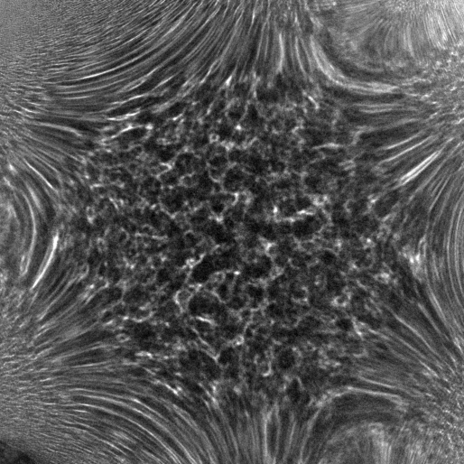
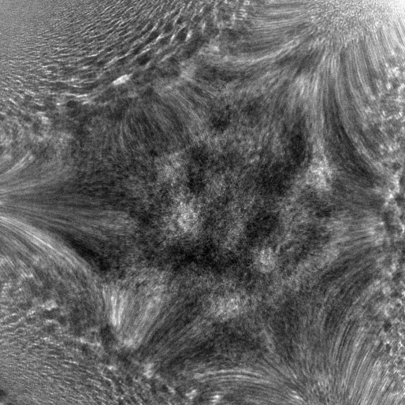

# Titan user manual
Thomas Aarholt, last edited Aug 2017

> Look at the air-conditioning sausage in the room. It should be filled.

## Setting up session
In the TEM User Interface:
- Stage2 -> Flapout -> Reset Holder
- Remove holder to airlock. Turn clockwise, then pull all the way out.
- Place holder upside down in cage. Remove old sample, place new one in, adding spacers as needed. Place the cover on top.
- Plasma clean sample. Now, check O-ring under the microscope. If needed, grease the O-ring.
- Insert Holder into Titan, with the little pin at about 4 O'clock.
- Wait 5 min AND until Octagon <= 5. Turn all the way anti-clockwise, then insert slowly all the way. Turn the Turbo pump off and wait until Octagon < 15. Open the column valves.

---
## When aligning the microscope from the start
- Reduce MAG to **SA 4400x**, but not lower.
> Going lower switches to LOW MAG and turns a major lens off, introducing hysteresis into the system.

- Locate sample in TEM mode. Then go to the FEG registers window, use the flapout to select user, and **SET** an appropriate Register. Make sure all the options for the register are ticked, ensuring the loading of all parameters.

- Insert largest (150um) C2 aperture. Make a scan at MAG > 500kx. Use the Beam Position Marker, click the centre of the image, double click the marker and set it to (256, 256) (or (512, 512) if necessary).

- Press the Diffraction button to go the Image mode. Eucentric Focus.

- Reset user beamshift by **Pre-corrector beam shift -> Done**. Now use the trackball to centre the beam at increasingly higher magnification.
- If the beam is stigmatic, correct this with the objective stigmator. Using **Intensity list (FOCUS)**, focus the beam using the **FOCUS** knob. Go for a 3-cross shape using focus and stig.

- Using pre-corrector beam tilt, and stopping the wobbler by rotating the focus coarseness, wobble intensity to check the centre of illumination. Correct it with **MF**, bringing the defocused centre towards the focussed centre.

---
## Start here if the microscope is well-aligned.
> Remove all detectors

- Centre the C2 aperture around the focussed beam.
- Switch from image mode to diffraction mode
- Activate MONO **focus** and **shift** in the MONO tab. Focus it inside the aperture with **Intensity** and **MF**. Then defocus it until we have a screen current of about 0.1 nA.
> Now find the sample by defocusing the beam, and moving onto something amorphous.

> Set magnification to maximum.

- Focus the Z-height. Reset condenser stig, and use A1 (coarse condenser stig) and B2 (coma) to remove coma and stig in the ronchigram.
- Introduce and centre the 70um C2 aperture on the ronchigram centre. Now adjust MONO focus to get a screen current of 0.1 nA.
- Eucentric focus. Go to **Image mode**. Correct objective astigmatism. Go to **Diffraction mode**.

- Choose a camera length: 77-195 mm for Fischione detectors, 38 mm for Gatan DF / EELS.

- Select Diffraction Alignment and centre the beam inside the detector. For the GIF detector, centre the beam at 5 O'clock a few mm from the screen black spot.

- Either blanking the beam or finding a hole, select **Scope**, and increase brightness until the dark intensity is above zero.

> Reduce mag ~115K

- **Search** and find a crystalline area. Focus the image and correct condenser stig.

The microscope is now ready for HR-STEM.

> Remember to save the current alignment in the FEG register.

---
## End of session

Reset holder position.
Close column valve.
Place binocular covers on.

---
## Detailed explanation for ronchigram alignment

Find your sample, find an amorphous or very polycrystalline region (damaged regions will do) and go to standard focus. Adjust Z until you have magnified your sample as much as possible. There will be a point between two ranges of magnification where the image flips and starts zooming out. The point where it flips is the point you want.

### Aligning the centre of rotation
Find a small hole or feature in the sample. Use the focus knob to zoom in on it so that it is centred on the black spot at gaussian focus. Turn the focus to zoom out far. Now centre the feature on the black spot using **Diffraction Alignment**. Zoom in again and centre the feature with the stage controller. Repeat if necessary.

### Aligning for Coma
Increase magnification to the highest value. This will stabilize the beam and let you see the “glassy” look of the ronchigram.
Defocus the image using the focus knob. This will zoom out on your sample. Zoom out until your sample (or a region about 10 um in length) is in view.
Enable **B2**. Now, using first the **MF X** and then the **Y** knobs, get a feel for how the coma shifts the image around.
The effect of coma in the Ronchigram can be compared with tilting an object towards and away from you. When coma is not perfect, the one edge of the image will appear stretched. It's important to drive the knobs beyond where one might think is the right position, in order to be sure.

Once the coma is aligned at high defocus, defocus the image a bit less so that it zooms in. Now repeat the alignment. Repeat this until you are at gaussian focus with an image that appears to be a *6-pointed star*. The edges of the star should appear stretched symmetrically outwards, and the middle should look a bit like **glassy water**.

>Left: 6-pointed star at slight defocus

>Right: Glassy centre of ronchigram

### Aligning for Astigmatism
Defocus the image a bit so that it zooms out. You should see about 5 um of your sample. Now enable **A1** (not **Condenser Stig**). By adjusting **MF X** and then **MF Y** you should see a blurry rotation and then the image zooming out. This will happen at either extreme of the adjustment of stig. Perfect stig is found at the middle of the “rotation”. Repeat this at less defocus (higher magnification). Some correction (focus and stig) might be necessary to get a perfect image on the BF/DF detectors.
Repeat both of these steps.

---
## For centering the beam on the GIF entrance
In order for the GIF to function well, the beam should be entering it perfectly. The GIF is not aligned with the black spot in the centre of the TEM screen, and we need to use the projector lenses to move it onto the centre of the GIF entrance.
Lift the TEM screen and switch from EELS to EFTEM mode in DM, but remain in STEM mode. Under the window **Camera View** set the exposure of the “GIF Camera” to 5.0e-5 s. With Camera Length of 38mm hit Start View. Use **Diffraction Alignment** to centre the round spot on the GIF. Then switch to EELS. The GIF Camera automatically turns off.

### Tips for aligning the EELS
- Use Turbo mode for aligning the EELS. For spectrum images (SIs), use SI Optimized. It is much faster.
- Manual alignment of the EELS is easy. Make sure the beam is in the centre of the GIF entrance according to the instruction above before starting. When aligning SY it is useful to make the ZLP “fat” by increasing X, and then adjusting SY until the brightness is uniformly through and not sitting at the top of bottom of the round shape.
- If you can’t see the ZLP whilst viewing the EELS spectrum, try changing the energy starting point to -100eV. The ZLP might come into view.
- If the EELS is consistently bad, or you see streakiness in the aligned ZLP image of an SI, then the EFTEM needs realignment. This is a semi-automated procedure and should be done by an expert.

### General EELS tips
- The best FWHM ZLP I have seen is 5.5eV. I suspect a dispersion smaller than 0.5eV/ch is pointless on a non-monochromated microscope.
- The GIF can only correct for beam shift (pivoting) horizontally across the field of view. Therefore, the position of the ZLP will move as the beam travels in one direction, but not in the other. At small dispersions (≤0.05eV/ch) when doing low mag SI EELS, use the “freeze beam” function to drag the beam around in the window you’ll be acquiring a SI. Watch the position of the ZLP to make sure it doesn't leave the energy range you want.
- Due to the above point, Drift Correction can give one false results. When one is acquiring multiple energy loss spectra (for instance low-loss and core loss) whilst doing drift correction, one should ensure that the sample is not drifting between acquisitions. If it is, one should view the ABF/ADF image and move the sample back into its original, “Survey Image” position. Otherwise the position of the ZLP may have moved and aligning the core loss spectra based on the ZLP spectra will give the wrong peak positions.
- Software Sync mode has an energy shift corrector to avoid the above problem. This does not exist for (the much faster) Hardware Sync.
- There is huge potential for writing scripts for DM. A script to acquire multiple SIs after each other (without resorting to leaky DualEELS) is sorely missed by me.

---
## Other info

#### Convergence angles:
|C2    |Convergence Angle|
|:----:|:---------------:|
|150 um|77.1 mrad        |
|70 um |36.0 mrad        |

#### Collection angles:
With 70 um C2 and 36mm CL:

|C2    |Camera Length    | Collection angle|
|:----:|:---------------:|:---------------:|
|70 um |38 mm            |26.6             |

---
## Best approach for finding a zone axis
